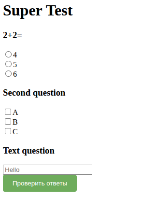

# Application
Automate test creation using html and js generation.
Generating tests with options (radio, checkbox) and text response. You can create test blocks using a graphical shell and DSL

# DSL
Syntax
- '?' - start question
- 'r' - radio answer
- 'c' - checkbox answers
- 't'- text
- '-' - start variant
- '+' - right answer
- 'e' - end of variants
- '_' - text

<p>
  Example
</p>

```
Title My title
H1 Super Test

? 2+2= r
- 4 +
- 5
- 6 e

? Second question c
- A
- B +
- C +e

? Text question t 
_ My answer
```

<p>Result</p>



<p>Style</p>
By default style as in screenshot result but you can ask your own. It is important for question blocks that the style class is .question
